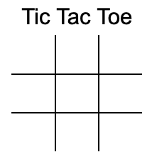
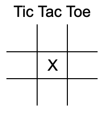
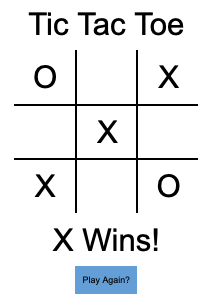
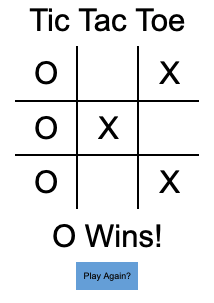

# Tic Tac Toe

You get to create your very own Tic Tac Toe game!

## Requirements
* The user can view the empty game board (see mock ups)
* Player 1 can click a cell and see an `X` appear
* The system will change the current players turn
* Player 2 can click the screen and see a `O` appear
* Once a cell is clicked on, neither player can select that cell again
* The system checks if a player has won after each move
* The user can view which player won 
* The user can click a button to start a new game 

## Mock-Ups

### New Game

### Player Move

### X Win

### O Win

